<!-- 1. desktoprig on top most (No Section Header) -->

  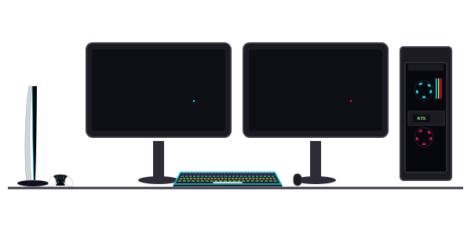

<!-- 2. terminal_sim.svg (Welcome To my workstation Header right after) -->
## 📟 Welcome To My Workstation

  

<!-- 3. smart_tv_apps.svg & Connect with me Header -->
## 📺 Connect With Me

  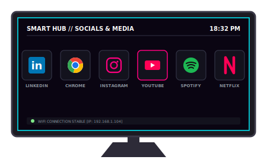

  
  
  
  <a href="https://x.com/theonlydevrai" target="_blank">
    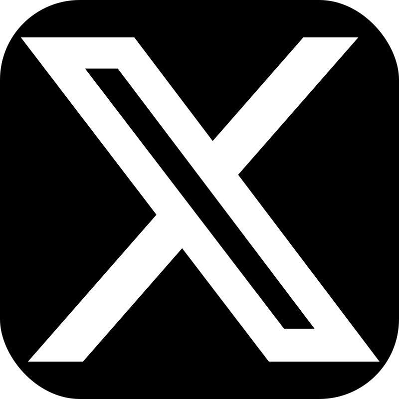
  </a>

---

<!-- 4. laptop_header.svg under About Me (No paragraphs) -->
## 👨‍💻 About Me

  

---

<!-- 5. Tech Skills -->
## 🛠️ Technical Skills

### A. Languages

  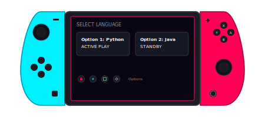

  
  
  
  
  
  
  

### B. Frameworks & Libraries

  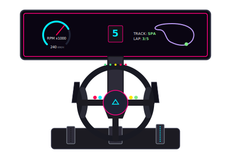

  
  
  
  
  
  
  

### C. Databases

  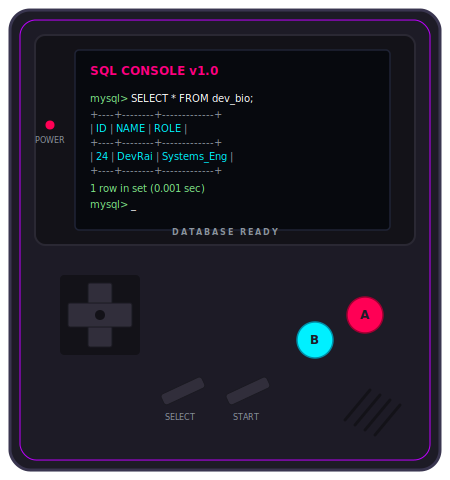

  
  
  
  

### D. Developer Tools

  

  
  
  
  
  
  

---

<!-- 6. TECH PROJECTS -->
## 📁 Technical Projects

### A. Distributed Event Ticketing Platform

  

* **Tech Stack:** React, TypeScript, Node.js, Express, MySQL, Redis, BullMQ
* A high-performance, fault-tolerant movie ticket booking system built to handle heavy concurrency during high-demand periods. 
* Integrates primary-backup replication, ring leader election (Chang-Roberts), Lamport logical clocks for conflict resolution, round-robin load balancing, and a multi-threaded background worker pool.

### B. Lex Simulacra: An AI Courtroom Simulator
<!-- Vertically Aligned: Phone 1 (Notch) -> Description -> Phone 2 (Retro) -->

  

* **Tech Stack:** Python, FastAPI, LangGraph, LangChain, ChromaDB
* An AI-powered legal courtroom simulation platform modeling realistic trial proceedings.
* Employs stateful multi-agent workflows managed with LangGraph. Features an advanced legal RAG pipeline with ChromaDB vector storage, citation enforcement, hallucination verification layers, and web search integrations.

  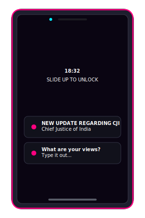

### C. Unified NLP Trust Tool

  

* **Tech Stack:** Python, Flask, JavaScript, scikit-learn, PyTorch
* A unified, multi-task NLP pipeline designed to protect digital consumers.
* Performs sentence-level legal risk detection in Terms & Conditions, filters out fake reviews, and conducts aspect-based sentiment analysis (ABSA). Features a helper Google Chrome extension to scrape DOM content directly and bypass rate-limiting blocks.

---

<!-- 7. Achievements & Honors (Isolated tables for clean backgrounds with borders) -->
## 🏆 Achievements & Honors

<table width="100%">
  <tr>
    <td width="45%" align="center" valign="middle">
      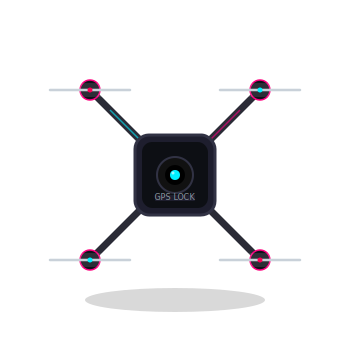
    </td>
    <td width="55%" valign="top">
      <h3>💻 Technical &amp; Hackathons</h3>
      <ul>
        <li><strong>Winner</strong> | State-Level MSBTE Project Competition</li>
        <li><strong>Winner</strong> | Makerthon Project Competition</li>
        <li><strong>Two-time Winner</strong> | State-Level Technical Paper Presentation</li>
      </ul>
    </td>
  </tr>
</table>

<!-- Subsection 2: Public Speaking, Debate & Quizzing (Side-by-side table) -->

<table width="100%">
  <tr>
    <td width="28%" align="center" valign="middle">
      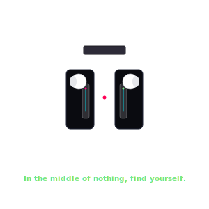
    </td>
    <td width="44%" valign="top">
      <h3 align="left">🗣️ Public Speaking, Debate &amp; Quizzing</h3>
      <ul>
        <li><strong>Medalist</strong> | World Scholar’s Cup (Earned 5 Gold Medals &amp; 2 Silver Medals)</li>
        <li><strong>Winner</strong> | National-Level Quiz Competition</li>
        <li><strong>Finalist</strong> | Canara Knowledge Champ (National-Level Quiz Competition at Canara Bank)</li>
        <li><strong>Winner</strong> | More than 10 Elocution Competitions across various levels</li>
        <li><strong>Winner</strong> | Institute-Level Debate Competitions</li>
      </ul>
    </td>
    <td width="28%" align="center" valign="middle">
      
    </td>
  </tr>
</table>

<!-- Subsection 3: Academic Excellence (Isolated table) -->

<table width="100%">
  <tr>
    <td width="45%" align="center" valign="middle">
      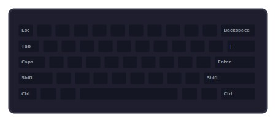
    </td>
    <td width="55%" valign="top">
      <h3>🎓 Academic Excellence</h3>
      <ul>
        <li><strong>Academic Topper</strong> | Secured the top rank for all semesters during Diploma in Computer Technology.</li>
        <li><strong>Best Student Award</strong> | Recipient of the overall best student honor at the institute level.</li>
      </ul>
    </td>
  </tr>
</table>

<!-- Subsection 4: Leadership & Positions of Responsibility (Isolated table) -->

<table width="100%">
  <tr>
    <td width="55%" valign="top">
      <h3>🤝 Leadership &amp; Positions of Responsibility</h3>
      <ul>
        <li>📌 <strong>Head of Public Relations</strong> | ENACTUS - SPIT</li>
        <li>📌 <strong>Elected Prime Minister</strong> | Student Council, SJHS</li>
      </ul>
    </td>
    <td width="45%" align="center" valign="middle">
      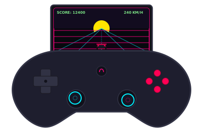
    </td>
  </tr>
</table>

---

<!-- 8. GitHub Stats and Smartwatches (Table Layout) -->
## 📊 Telemetry & Workstation Stats

<table width="100%">
  <tr>
    <td width="30%" align="center" valign="middle">
      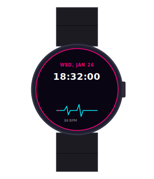
    </td>
    <td width="40%" align="center" valign="middle">
      <picture>
        <source srcset="https://github-readme-streak-stats-j8aj.vercel.app/?user=theonlydevrai&background=000000&border=30363d&stroke=ffffff&ring=fe7d37&fire=fe7d37&currStreakNum=ffffff&sideNums=ffffff&currStreakLabel=ffffff&sideLabels=ffffff&dates=ffffff&hide_border=true&cache_seconds=60" media="(prefers-color-scheme: dark)" />
        <source srcset="https://github-readme-streak-stats-j8aj.vercel.app/?user=theonlydevrai&theme=default&cache_seconds=60" media="(prefers-color-scheme: light)" />
        
      </picture>
    </td>
    <td width="30%" align="center" valign="middle">
      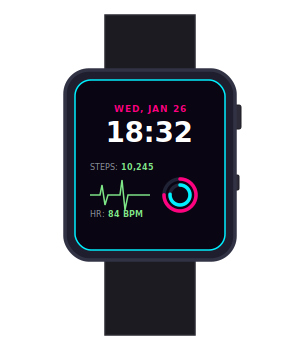
    </td>
  </tr>
</table>

---

<!-- 9. A Thought Worth Looking Into (Vertically Aligned, Larger VR SVG) -->
## 🧠 A Thought Worth Looking Into

  

  

