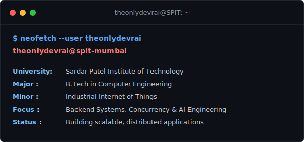

<!-- Header Banner with High-Contrast Text -->

  

<!-- Cleaned & Expanded Typing Animation -->

  

<!-- Social & Contact Grid -->

  
  
  
  

---

### 📟 Initialize dev_rai.sh

  

---

### 👨‍💻 About Me

I am a **Computer Engineering student** at **Sardar Patel Institute of Technology (SPIT), Mumbai**. My engineering focus lies primarily on constructing reliable backend architectures, designing high-throughput distributed systems, and utilizing modern artificial intelligence frameworks.

- 🎓 Pursuing a **B.Tech in Computer Engineering** with an **IIoT Minor**.
- ⚡ Focused on clean architectural patterns, concurrency safety, and database optimization.
- 🧠 Actively researching and designing multi-agent LLM pipelines and robust natural language processing utilities.

---

### 🛠️ Technical Skills

#### 🔤 Languages

#### ⚙️ Frameworks & Libraries

#### 🗄️ Databases

#### 🔧 Developer Tools

---

### 📁 Technical Projects

#### 🎫 [Distributed Event Ticketing Platform](https://github.com/theonlydevrai/tms)
* **Tech Stack:** React, TypeScript, Node.js, Express, MySQL, Redis, BullMQ
* A high-performance, fault-tolerant movie ticket booking system built to handle heavy concurrency during high-demand periods. 
* Integrates primary-backup replication, ring leader election (Chang-Roberts), Lamport logical clocks for conflict resolution, round-robin load balancing, and a multi-threaded background worker pool.

#### ⚖️ [Lex Simulacra: An AI Courtroom Simulator](https://github.com/prasad-gade05/Law_Courtroom_Simulator)
* **Tech Stack:** Python, FastAPI, LangGraph, LangChain, ChromaDB
* An AI-powered legal courtroom simulation platform modeling realistic trial proceedings.
* Employs stateful multi-agent workflows managed with LangGraph. Features an advanced legal RAG pipeline with ChromaDB vector storage, citation enforcement, hallucination verification layers, and web search integrations.

#### 🧠 [Unified NLP Trust Tool](https://github.com/theonlydevrai/unified-nlp-trust-tool)
* **Tech Stack:** Python, Flask, JavaScript, scikit-learn, PyTorch
* A unified, multi-task NLP pipeline designed to protect digital consumers.
* Performs sentence-level legal risk detection in Terms & Conditions, filters out fake reviews, and conducts aspect-based sentiment analysis (ABSA). Features a helper Google Chrome extension to scrape DOM content directly and bypass rate-limiting blocks.

---

### 🏆 Achievements & Honors

#### 💻 Technical & Hackathons
* **Winner** | State-Level MSBTE Project Competition
* **Winner** | Makerthon Project Competition
* **Two-time Winner** | State-Level Technical Paper Presentation

#### 🗣️ Public Speaking, Debate & Quizzing
* **Medalist** | World Scholar’s Cup (Earned 5 Gold Medals & 2 Silver Medals)
* **Winner** | National-Level Quiz Competition
* **Finalist** | Canara Knowledge Champ (National-Level Quiz Competition at Canara Bank)
* **Winner** | More than 10 Elocution Competitions across various levels
* **Winner** | Institute-Level Debate Competitions

#### 🎓 Academic Excellence
* **Academic Topper** | Secured the top rank for all semesters during Diploma in Computer Technology.
* **Best Student Award** | Recipient of the overall best student honor at the institute level.

---

### 🤝 Leadership & Positions of Responsibility

* 📌 **Head of Public Relations** | ENACTUS - SPIT
* 📌 **Elected Prime Minister** | Student Council, SJHS

---

### ☕ Compiled Thoughts

  

